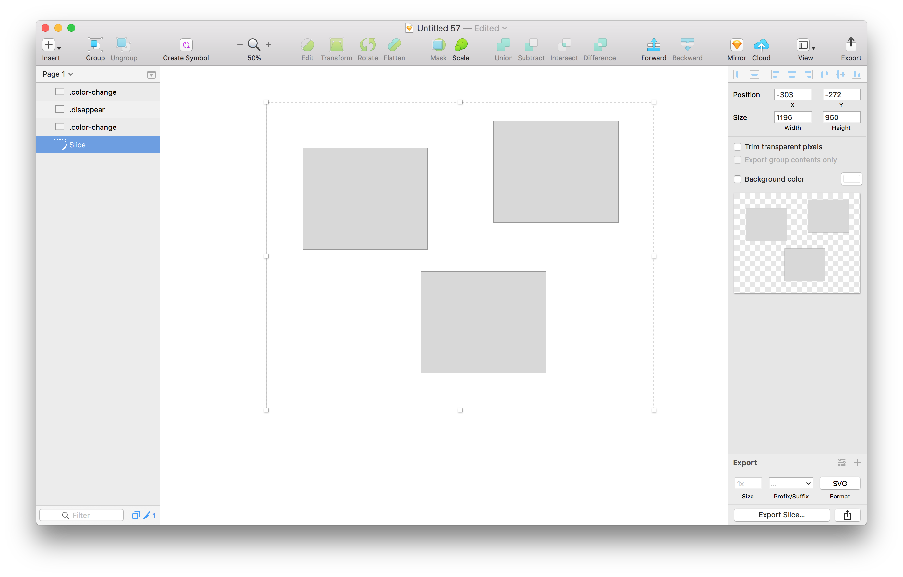
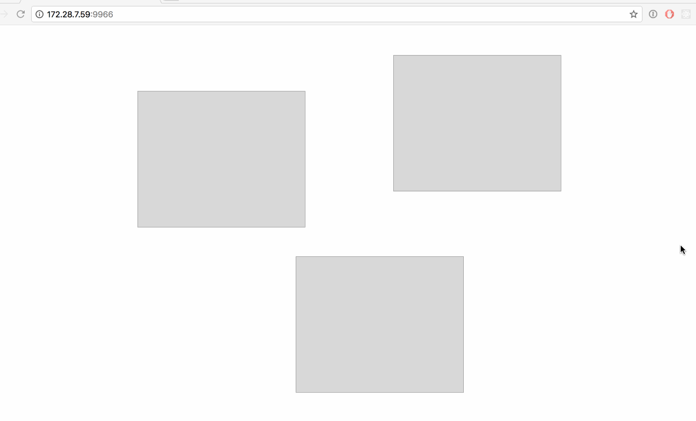

# Sketch Interactive Export


This is a sketch plugin designed to make it easy to use JavaScript (e.g. D3) to add
interactivity to SVGs created with sketch.

## What does this do?

This plugin does two main things:

* It uses your Sketch layer names to add class names to exported SVG
  * CSS conventions are used to determine class names. For example, if you have a layer named like `.blue.rectangle`, the resulting SVG markup will contain `class="blue rectangle"`.
  * Anything in the layername that isn't prefixed with a period will be used as the ID (as is standard Sketch behaviour). So, for example a layer named `my-id.classname`  will result in markup like `id="my-id" class="classname"`
* It removes the hard coded `width` and `height` values from the SVG markup, and uses `viewBox` instead, so that everything is responsive.

## Example

### Designing in sketch

For example, here is a simple Sketch that shows three rectanges, two with the class `color-change` and one
with the class disapper:



Becomes


```
<?xml version="1.0" encoding="UTF-8"?>
<svg  viewBox="0 0 1338 1142" version="1.1" xmlns="http://www.w3.org/2000/svg" xmlns:xlink="http://www.w3.org/1999/xlink">
    <!-- Generator: Sketch 48.2 (47327) - http://www.bohemiancoding.com/sketch -->
    <title>Slice</title>
    <desc>Created with Sketch.</desc>
    <defs>
        <rect id="path-1" x="136" y="244" width="386" height="314"></rect>
        <rect id="path-2" x="769" y="123" width="386" height="314"></rect>
        <rect id="path-3" x="798" y="653" width="386" height="314"></rect>
        <rect id="path-4" x="226" y="746" width="386" height="314"></rect>
    </defs>
    <g id="Page-1" stroke="none" stroke-width="1" fill="none" fill-rule="evenodd">
        <g class="color-change" id="">
            <use fill="#D8D8D8" fill-rule="evenodd" xlink:href="#path-1"></use>
            <rect stroke="#979797" stroke-width="1" x="136.5" y="244.5" width="385" height="313"></rect>
        </g>
        <g class="disappear" id="">
            <use fill="#D8D8D8" fill-rule="evenodd" xlink:href="#path-2"></use>
            <rect stroke="#979797" stroke-width="1" x="769.5" y="123.5" width="385" height="313"></rect>
        </g>
        <g class="color-change" id="">
            <use fill="#D8D8D8" fill-rule="evenodd" xlink:href="#path-3"></use>
            <rect stroke="#979797" stroke-width="1" x="798.5" y="653.5" width="385" height="313"></rect>
        </g>
        <g class="spin" id="">
            <use fill="#D8D8D8" fill-rule="evenodd" xlink:href="#path-4"></use>
            <rect stroke="#979797" stroke-width="1" x="226.5" y="746.5" width="385" height="313"></rect>
        </g>
    </g>
</svg>
```


### Using with D3


We can use D3 to select portions of the exported SVG and dynamically add interactions. For example, this
code changes the color of the rectangles with the `color-change` class, and fades out the rectangle with
the `disappear` class when a user clicks them.

```
const d3 = require('d3');
const fs = require('fs');

const svgString = fs.readFileSync(__dirname + '/example.svg', 'utf8');
const svg = d3.select('body').html(svgString).select('svg');

svg.selectAll('.color-change')
  .on('click', function() {
    // random fill
    d3.select(this).transition().attr('fill', "hsl(" + Math.random() * 360 + ",100%,50%)")
  })

svg.selectAll('.disappear')
  .on('click', function() {
    // fade out
    d3.select(this).transition().attr('opacity', 0)
    setTimeout(() => {
      d3.select(this).transition().attr('opacity', 1)
    }, 500);
  })
```

This results in the following behaviour




## How to hack on this package

_This plugin was created using `skpm`. For a detailed explanation on how things work, checkout the [skpm Readme](https://github.com/skpm/skpm/blob/master/README.md)._

Install the dependencies

```bash
npm install
```

Once the installation is done, you can run some commands inside the project folder:

```bash
npm run build
```

To watch for changes:

```bash
npm run watch
```

Additionally, if you wish to run the plugin every time it is built:

```bash
npm run start
```

### Custom Configuration

#### Babel

To customize Babel, you have two options:

* You may create a [`.babelrc`](https://babeljs.io/docs/usage/babelrc) file in your project's root directory. Any settings you define here will overwrite matching config-keys within skpm preset. For example, if you pass a "presets" object, it will replace & reset all Babel presets that skpm defaults to.

* If you'd like to modify or add to the existing Babel config, you must use a `webpack.skpm.config.js` file. Visit the [Webpack](#webpack) section for more info.

#### Webpack

To customize webpack create `webpack.skpm.config.js` file which exports function that will change webpack's config.

```js
/**
 * Function that mutates original webpack config.
 * Supports asynchronous changes when promise is returned.
 *
 * @param {object} config - original webpack config.
 * @param {boolean} isPluginCommand - wether the config is for a plugin command or a resource
 **/
module.exports = function (config, isPluginCommand) {
  /** you can change config here **/
}
```

### Debugging

To view the output of your `console.log`, you have a few different options:

* Use the [`sketch-dev-tools`](https://github.com/skpm/sketch-dev-tools)
* Open `Console.app` and look for the sketch logs
* Look at the `~/Library/Logs/com.bohemiancoding.sketch3/Plugin Output.log` file

Skpm provides a convenient way to do the latter:

```bash
skpm log
```

The `-f` option causes `skpm log` to not stop when the end of logs is reached, but rather to wait for additional data to be appended to the input

